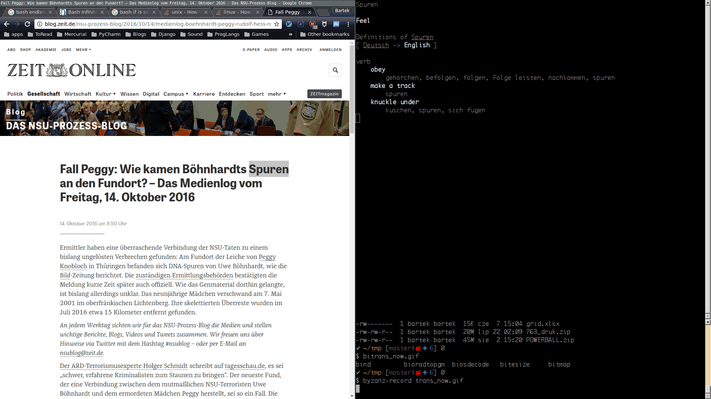

# trans_now

A wrapper for soimort/translate-shell connecting it to primary clipboard real time.

I want to read articles in foreign languages that I dabbled in on-line. I need 
a very responsive dictionary to do this, by which I mean, it has to quickly do 
what I mean without taking away my focus from the task. This wrapper checks the
current selection (Linux only) and feeds it to [translate-shell](https://github.com/soimort/translate-shell)
displaying result in console and waiting for next. This is fast enough. The 
problem was inspired by how Kindle solves its dictionaries.



# Install

```
# as root or whatever, stop complaining about everything

# Install trans - my way or https://github.com/soimort/translate-shell#option-1-direct-download
wget https://raw.githubusercontent.com/bartekbrak/trans_now/master/install.trans.bash -O - | bash -x

# Install dependencies
apt-get install xsel

# Install me 
if ! command -v trans_now
then
    wget https://git.io/vPoJo -O /usr/local/bin/trans_now
    chmod +x /usr/local/bin/trans_now
fi
```